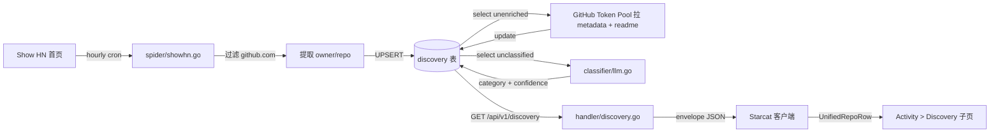

# AI Discovery（Show HN）设计

> 创建：2026-06-11
> 状态：设计稿（待评审 → 实施）
> 版本：v1.0
> 关联：
> - `docs/需求讨论/Starcat-AI-Discovery-ShowHN-Plan.md`（v1 原始需求，本设计是其升级版）
> - `docs/详细设计/16-活动页设计.md`（Activity 现有 6 分类骨架，本设计是其第 7 分类扩展）
> - `docs/详细设计/18-三场景共用架构.md`（envelope / Bearer Auth / UnifiedRepoRow / RepoDetailScaffold / StarredRegistry，**本设计沿用**）
> - `docs/详细设计/19-wiki集成.md`（zread spider + enricher + 单文件 createSchema 模式，**本设计仿写**）
> - 后端脚手架：`supports/starcat-weekly-api`（端口 5003，本设计在内新增 `discovery` 表 + 3 端点）

---

## 文档版本演进

| 版本 | 日期 | 主要调整 | 触发人 / 触发原因 |
|---|---|---|---|
| v1.0 | 2026-06-11 | 把 v1 需求文档（`docs/需求讨论/Starcat-AI-Discovery-ShowHN-Plan.md`）升级为可落地设计：四项核心决策（Q1 Activity 第 7 分类 / Q2 寄生 weekly-api / Q3 单标签互斥 / Q4 24h 窗口 + 合并记录）+ 完整 schema + 后端实现清单 + 客户端实现清单 + 文档同步清单 | dong4j 2026-06-11 拍板四项关键决策；v1 文档保留作为讨论历史不再维护 |

---

## 1. 背景与目标

### 1.1 现状（截至 2026-06-11）

- `Activity` 模块已上线 6 个分类：`announcement` / `release` / `star` / `repository` / `following` / `suggestion`（详见 `docs/详细设计/16-活动页设计.md`）
- `starcat-weekly-api`（端口 5003）已在做「外部数据源 → 入库 → envelope API」职责（阮一峰周刊 + zread Trending），与 Show HN 抓取语义对齐
- 4 个后端服务（trending / weekly / sharing / wiki）已统一 `envelope schema_version+data+meta` + `Authorization: Bearer` + `/api/v1/ping`（R-01 v1.2 / R-03）
- 4 个后端服务统一 `createSchema(s)` 单文件 schema 模式，无 `user_version` / 无 destructive migration（2026-06-10 决策）
- 客户端已上线 `UnifiedRepoRow` + `RepoDetailScaffold` + `StarredRegistry` 共用骨架（R-01 v2.0），跨场景 ✓ 标记由 registry 驱动；未 star 项目走 ephemeral repo 链路
- 客户端 `BackendAggregateRepoSource` 已实现「未 star 详情页降级聚合」链路（R-01 RISK-2 解除）
- 客户端「设置 → 服务连接」已支持 4 个后端服务的 BYOK API Key + URL + R-03 单步 `/api/v1/ping` 测试

### 1.2 问题

GitHub Star 用户面对「AI 项目井喷」时痛点突出：

1. **Trending 滞后**：`starcat-trending-api` 的 GitHub Trending 数据是「已经验证热门」的项目（一般要积累 100+ stars 才进 daily trending），错过早期发现窗口
2. **官方 Explore 不足**：GitHub 官方 Trending / Explore 不专注 AI 子领域，AI Agent / MCP / RAG 等垂类项目混在一起
3. **Show HN 是早期信号**：`https://news.ycombinator.com/show` 是开发者社区「项目刚上线找用户」的主战场，含大量 GitHub 链接，是 Trending 之前的 leading indicator
4. **AI 子领域分类缺失**：用户想按「我现在关心 AI Agent」或「我想看 MCP Server」过滤，没有现成数据源做这个粒度的归类

### 1.3 目标

1. **Show HN → GitHub 链路自动化**：每小时抓 Show HN 首页，过滤出含 GitHub URL 的帖子，提取 `owner/repo`，进入 enricher 队列
2. **AI 单标签分类**：用 LLM 把 repo 归为 7 个 AI 子分类之一（agent / coding / mcp / rag / infra / model / skill），低置信度落 `unknown`
3. **复用现有客户端骨架**：作为 `Activity` 的第 7 个分类（`ActivityCategory.discovery`），中栏 segmented 切 8 子分类（含 `all`），row 用 `UnifiedRepoRow`，详情页用 `RepoDetailScaffold` + ephemeral repo 链路
4. **后端寄生 weekly-api**：新增 `discovery` 表 + 3 端点 + 1 cron + LLM classifier，不开新服务、不动 trending-api

### 1.4 非目标

1. **不接入 Show HN 之外的源**：Product Hunt / Reddit LocalLLaMA / HuggingFace Trending / Awesome AI 列出但留待 v2
2. **不做多标签分类**：一个 repo 只属于一个主分类（Q3 决策）；多标签会让 UI tab 切换语义复杂、prompt 成本高
3. **不做 star 跃迁触发再分类**：分类一次后稳定，仅在 LLM 失败时冷却 7 天后重试（YAGNI）
4. **不做客户端缓存**：每次走后端，weekly-api 已有 SQLite 持久化 + 最多 30 条 24h 内数据，体量很小
5. **不做中文翻译字段**（`description_zh`）：留待对接 wiki-api 时再加，当前不是核心痛点
6. **不做后台人工修正 UI**：分类错误反馈机制留待 v2，第一版只通过更新 LLM prompt + 数据库直接 SQL 修正

---

## 2. 总体方案

### 2.1 架构数据流



### 2.2 与现有架构的复用关系

| 现有能力 | AI Discovery 的复用方式 |
|---|---|
| `starcat-weekly-api` cron scheduler | 加一个每小时整点 cron job `RunDiscoveryOnce`，与 zread 周一 06:00 / 阮一峰每日 09:00 错峰 |
| `starcat-weekly-api` GitHub Token Pool | enricher 直接调用现有 token pool（zread enricher 同款） |
| `starcat-weekly-api` Bearer Auth 中间件 | 3 个新端点全部走现有 `middleware/auth.go` |
| `starcat-weekly-api` envelope `schema_version + data + meta` | response 复用 `internal/model/envelope.go` 共享 envelope |
| `StarcatRepoCardDTO`（共享 DTO） | response `data` 复用，仅 `meta` 段加 `category` 字段 |
| 客户端 `WeeklyAPI` actor | 加 `fetchDiscovery` / `fetchDiscoveryDetail` 两个方法，复用现有 actor 的 `apiKey` / `baseURL` / Bearer header / envelope 解码 |
| 客户端 `UnifiedRepoRow` + `RepoDetailScaffold` | row + 详情页直接复用，未 star 走 ephemeral repo |
| 客户端 `StarredRegistry` | ✓ 标记的派生信号，与 trending / weekly 一致 |
| 客户端 `BackendAggregateRepoSource` | 详情页 resolveRepo 链路同 trending / weekly |

### 2.3 关键决策摘要（Q1–Q4）

| 编号 | 决策点 | 选定方案 | 拒绝方案与理由 |
|---|---|---|---|
| Q1 | 导航位置 | Activity 第 7 分类 | A. 升级顶栏一级会让顶栏拥挤；B. 在 trending 下做二级 tab 跟「趋势」语义重叠；C. 把 trending 也搬到 activity 改动太大 |
| Q2 | 后端归属 | 寄生 starcat-weekly-api | A. 独立 starcat-discovery-api 工程量大且要复制 4 件套；B. 寄生 trending-api 跟「已验证热门」语义不符 |
| Q3 | AI 分类 | 单标签互斥 + confidence 阈值 | B. 多标签让 UI tab 重复出现 + LLM prompt 复杂；C. 规则先行 + LLM fallback 维护负担重 |
| Q4 | 抓取边界 | 每小时首页（~30 条）+ 24h 窗口 + (owner,repo) 唯一键合并 | B. 保留多次 hn_id 历史 list 需去重；C. 宽窗口（前 3 页 / 7 天）API 压力 ×3 |

---

## 3. AI 分类体系

### 3.1 7 个主分类（不含 unknown）

| 分类 | enum 值 | 定义 | 标杆项目 |
|---|---|---|---|
| AI Agent | `agent` | 多步推理、工具调用、规划任务的 Agent 框架 / 应用 | CrewAI, AutoGen, LangGraph, Mastra |
| AI Coding | `coding` | 代码生成、代码补全、CLI / IDE 编程助手 | OpenHands, Aider, Continue, OpenCode, Roo Code |
| AI MCP | `mcp` | Model Context Protocol 服务端 / 客户端 / 注册表 / 网关 | MCP Server, MCP Registry, MCP Gateway |
| AI RAG | `rag` | 检索增强生成、Knowledge Graph + RAG、向量库工程 | RAGFlow, GraphRAG, Dify RAG |
| AI Infra | `infra` | 模型推理 / 部署 / 调度 / 加速基础设施 | vLLM, LiteLLM, Ollama, Ray |
| AI Model | `model` | 开源大模型本体（含权重） | Qwen, DeepSeek, Llama, Gemma, GLM |
| AI Skill | `skill` | 可被 Agent / Assistant 直接加载和复用的能力包 | SkillsJars, Agent Skills, Prompt Packs, AI Workflow Templates |

### 3.2 unknown 分类

- LLM 返回 confidence < `DISCOVERY_CONFIDENCE_THRESHOLD`（默认 0.6）
- LLM 返回的 category 不在 7 类白名单内
- LLM 调用失败（超时 / 4xx / 5xx），3 次后冷却 7 天
- 客户端默认不展示（segmented control 8 个 tab：`all / agent / coding / mcp / rag / infra / model / skill`，不显 `unknown`）

### 3.3 分类优先级（解决重叠）

LLM prompt 内显式写明优先级，处理多义场景（如 LangGraph 既是 Agent 框架又有 Skill 模板，OpenHands 是 Coding 但也含 Agent 编排）：

```
判定优先级（更具体的优先）：skill > mcp > agent > coding > rag > infra > model
```

- 一个项目同时是 Agent 框架 + Skill 包 → 归 `skill`（更具体）
- 一个项目同时是 MCP Server + Agent 容器 → 归 `mcp`（协议层比应用层更具体）
- 一个项目是 Coding 助手 + 内部用 RAG → 归 `coding`（用户感知层在 Coding）
- 一个项目是 RAG 系统 + 自带模型权重 → 归 `rag`（应用层比底座层更具体）

### 3.4 LLM Prompt 设计要点

- 输入：`description`（GitHub repo description）+ `topics`（前 10 个 topic）+ `readme_excerpt`（README 头 2000 字符，去除图片 / badge / TOC）
- 输出：严格 JSON `{"category": "agent|coding|mcp|rag|infra|model|skill|unknown", "confidence": 0.0-1.0, "reason": "<= 80 chars 中文"}`
- 模型：默认 `deepseek-chat`（成本最低 + 中文友好），可经 `LLM_MODEL` 环境变量切换
- Token 预算：input ~2500 tokens / output ~80 tokens / 单次 ~$0.0003（DeepSeek 价格）；30 条 / 小时 → 月成本 < $1
- 失败 fallback：`category='unknown'`, `classify_attempts++`，3 次后 `last_attempt_at` 冻 7 天

---

## 4. 数据库设计（weekly-api 内新建）

### 4.1 discovery 表

新增到 `supports/starcat-weekly-api/internal/store/sqlite.go` 的 `createSchema(s)` 函数里，与 `weekly_issues` / `projects` / `zread_trending` 三表平级。

```sql
CREATE TABLE IF NOT EXISTS discovery (
    -- HN 段（spider 写入）
    owner TEXT NOT NULL,
    repo TEXT NOT NULL,
    hn_id TEXT NOT NULL,
    hn_title TEXT NOT NULL,
    hn_url TEXT NOT NULL,
    hn_score INTEGER NOT NULL DEFAULT 0,
    hn_comments INTEGER NOT NULL DEFAULT 0,
    hn_published_at DATETIME NOT NULL,

    -- GitHub Enricher 段（与 zread_trending 字节对齐，方便复用 DTO 转换）
    gh_repo_id INTEGER,
    description TEXT,
    homepage TEXT,
    language TEXT,
    stars INTEGER,
    forks INTEGER,
    watchers INTEGER,
    open_issues INTEGER,
    subscribers_count INTEGER,
    owner_avatar_url TEXT,
    default_branch TEXT,
    license_spdx TEXT,
    topics_json TEXT,
    contributors_json TEXT,
    pushed_at DATETIME,
    repo_created_at DATETIME,
    enriched_at DATETIME,
    is_unavailable INTEGER NOT NULL DEFAULT 0,

    -- AI 分类段
    category TEXT NOT NULL DEFAULT 'unknown',
    classify_confidence REAL,
    classify_method TEXT,
    classify_model TEXT,
    classify_attempts INTEGER NOT NULL DEFAULT 0,
    classify_last_attempt_at DATETIME,
    classified_at DATETIME,

    -- 元数据段
    first_seen_at DATETIME NOT NULL,
    last_seen_at DATETIME NOT NULL,
    updated_at DATETIME NOT NULL,

    PRIMARY KEY (owner, repo)
);

CREATE INDEX IF NOT EXISTS idx_discovery_category_score
    ON discovery(category, hn_score DESC);
CREATE INDEX IF NOT EXISTS idx_discovery_published_at
    ON discovery(hn_published_at DESC);
CREATE INDEX IF NOT EXISTS idx_discovery_unenriched
    ON discovery(enriched_at) WHERE enriched_at IS NULL;
CREATE INDEX IF NOT EXISTS idx_discovery_unclassified
    ON discovery(category, classify_attempts) WHERE category = 'unknown';
```

### 4.2 关键约束（写进 createSchema 顶部注释）

1. **不做 destructive migration**：项目未上线，任何现存 `weekly.db` 直接 `rm` 即可；不引入 `PRAGMA user_version` 机制
2. **(owner, repo) 复合主键**：Q4 决策的实现层落点 —— 同一 repo 重复 Show HN 时 `ON CONFLICT(owner, repo) DO UPDATE SET hn_score=excluded.hn_score, hn_comments=excluded.hn_comments, last_seen_at=now, updated_at=now`，原始 `hn_id` / `hn_title` / `hn_url` / `hn_published_at` **保留首次值**
3. **JSON-as-TEXT 字段**：`topics_json` / `contributors_json` 与 `zread_trending` 同款，handler 层直接 pass-through 给客户端，weekly-api 不做结构化解析
4. **enricher / classifier 分离**：`enriched_at IS NULL` 与 `category='unknown' AND classify_attempts < 3` 是独立的索引选取条件，分别由 enricher 和 classifier 队列消费
5. **24h 窗口在 Query 层**：表本身保留全部历史（spider 不删除），`HandleDiscoveryV1` 加 `WHERE hn_published_at >= datetime('now', '-1 day')` 过滤；后续切窗口策略不需要 schema 变更

### 4.3 与 zread_trending 字段对齐性

| 字段 | discovery | zread_trending | 一致性 |
|---|---|---|---|
| `gh_repo_id` | INTEGER | INTEGER | ✓ |
| `description` | TEXT | TEXT | ✓ |
| `homepage` | TEXT | TEXT | ✓ |
| `language` | TEXT | TEXT | ✓ |
| `stars / forks / watchers / open_issues / subscribers_count` | INTEGER × 5 | INTEGER × 5 | ✓ |
| `owner_avatar_url / default_branch / license_spdx` | TEXT × 3 | TEXT × 3 | ✓ |
| `topics_json / contributors_json` | TEXT × 2 | TEXT × 2 | ✓ |
| `pushed_at / repo_created_at / enriched_at` | DATETIME × 3 | DATETIME × 3 | ✓ |
| `is_unavailable` | INTEGER | INTEGER | ✓ |

→ enricher 实现可以直接复用 zread enricher 的 metadata 拉取 + license + contributors 提取逻辑，仅 `UPDATE` 目标表名不同。

---

## 5. 后端 weekly-api 实现清单

工程量约 1 天，仿 zread 三件套（spider + types + enricher）+ 新增 LLM classifier 模块。所有路径均在 `supports/starcat-weekly-api/` 内。

### 5.1 新增文件

| 路径 | 职责 | 仿写参考 |
|---|---|---|
| `internal/spider/showhn.go` | 抓 Show HN 首页 HTML，正则提取 `https://github.com/{owner}/{repo}` | `internal/spider/zread.go` |
| `internal/spider/showhn_types.go` | `ShowHNFetchResult` / `ShowHNItem` 结构体 | `internal/spider/zread_types.go` |
| `internal/spider/hn_algolia.go` | 调 HN Algolia API（`https://hn.algolia.com/api/v1/items/{hn_id}`）拿 score / num_comments | 新增 |
| `internal/classifier/llm.go` | OpenAI 兼容 SDK 调用 + JSON 严格解析 + 7 类 + 优先级 prompt | 新增（无既有参考） |
| `internal/classifier/llm_test.go` | mock LLM response 8 类（含 unknown） + 低置信度走 unknown + 失败 fallback | 新增 |
| `internal/model/discovery.go` | `DiscoveryItem` 行模型 + `DiscoveryEnvelope` | `internal/model/zread_trending.go` |
| `internal/handler/discovery.go` | 3 个 handler（list / single / admin sync） | `internal/handler/zread_trending.go` |
| `internal/handler/discovery_test.go` | 200 envelope + Bearer 鉴权 + category 参数校验 | `internal/handler/handler_test.go` |
| `internal/spider/showhn_test.go` | HTML / JSON fixture 解析 | `internal/spider/zread_test.go` |

### 5.2 编辑现有文件

| 路径 | 改动 |
|---|---|
| `internal/store/sqlite.go` | `createSchema(s)` 加 `discovery` 表 + 4 索引；新增 `UpsertDiscoveryFromShowHN` / `UpdateDiscoveryEnriched` / `UpdateDiscoveryClassified` / `QueryDiscovery(category, page, pageSize)` / `GetDiscoveryByOwnerRepo(owner, repo)` / `GetUnenrichedDiscovery(limit)` / `GetUnclassifiedDiscovery(limit, maxAttempts)` |
| `internal/store/sqlite_test.go` | 加 5 case：UpsertFromShowHN 幂等 / `(owner,repo)` 冲突仅 update score-comments-last_seen / QueryDiscovery 分类过滤 + 24h 时间窗口 / unenriched 索引选取 / unclassified 索引选取 + 冷却跳过 |
| `cmd/server/main.go` | 注册 3 个新路由 + 启动 banner 加 3 行 + 启动期触发首次 sync |
| `internal/scheduler/cron.go` | 加每小时整点 `RunDiscoveryOnce`（spider → enrich → classify 三段串行）；与 zread 周一 06:00 / 阮一峰每日 09:00 错峰 |
| `.env.example` | 加 `LLM_API_BASE` / `LLM_API_KEY` / `LLM_MODEL`（默认 `deepseek-chat`） / `DISCOVERY_CONFIDENCE_THRESHOLD`（默认 `0.6`） / `DISCOVERY_MAX_CLASSIFY_ATTEMPTS`（默认 `3`） / `DISCOVERY_CLASSIFY_COOLDOWN_DAYS`（默认 `7`） |
| `CHANGELOG.md` | 加 `[0.6.0] - 2026-06-XX` 段，列出 spider / classifier / store / handler 4 块 |
| `README.md` | 加端点章节（参照现有 `/api/v1/zread` 段格式） |
| `todo.list` | 标记完成项 |

### 5.3 三个新端点

| 方法 | 路径 | 鉴权 | 用途 |
|---|---|---|---|
| `GET` | `/api/v1/discovery?category=&page=&page_size=` | Bearer | 列表查询；`category` 取值 `all/agent/coding/mcp/rag/infra/model/skill`；默认 `all` 不含 `unknown`；`page_size` 上限 50 |
| `GET` | `/api/v1/discovery/{owner}/{repo}` | Bearer | 详情页单查（客户端 `BackendAggregateRepoSource` 用） |
| `POST` | `/internal/sync/discovery` | Bearer | 内部 sync 触发（手动调试 + 客户端 admin 入口预留） |

### 5.4 端点响应 envelope

复用 `internal/model/envelope.go` 共享 envelope，`data` 段位嵌入 `[]StarcatRepoCardDTO`，`meta` 段位扩展两个字段：

```json
{
  "schema_version": "v1",
  "data": [
    {
      "id": 1234567,
      "fullName": "owner/repo",
      "description": "...",
      "...": "（同 trending / weekly 的 StarcatRepoCardDTO）",
      "discovery": {
        "hnId": "39823456",
        "hnTitle": "Show HN: ...",
        "hnUrl": "https://news.ycombinator.com/item?id=39823456",
        "hnScore": 142,
        "hnComments": 38,
        "hnPublishedAt": "2026-06-11T08:30:00Z",
        "category": "agent",
        "classifyConfidence": 0.92
      }
    }
  ],
  "meta": {
    "page": 1,
    "page_size": 30,
    "total": 28,
    "category": "all",
    "generated_at": "2026-06-11T15:00:00Z"
  }
}
```

→ 客户端 `StarcatRepoCardDTO` 加一个可选 `discovery: DiscoveryExtension?` 段位（与 trending / weekly 段位平级），`UnifiedRepoRow` 通过 `RepoCardViewData.TrailingBadge.discoveryHN(score, comments)` 渲染右上角徽标。

---

## 6. 客户端 Starcat 实现清单

工程量约半天。**核心策略**：Activity 第 7 分类 + 中栏 segmented + 全套 row / 详情页 / API 复用现有骨架。

### 6.1 Activity 第 7 分类（侧栏）

| 文件 | 改动 |
|---|---|
| `Starcat/Features/Activity/ActivityModels.swift` | `ActivityCategory` 加 `case discovery`；`ActivityKind` 加 `case discovery` |
| `Starcat/Resources/Localizable.xcstrings` | 加 `activity.category.discovery`（zh-Hans「AI 发现」/ en「AI Discovery」）+ `activity.discovery.subtitle`（zh-Hans「来自 Show HN 的 AI 项目」） |
| `Starcat/Core/Settings/AppSettings.swift` | 新增 `lastDiscoverySubcategoryRaw` UserDefaults key（持久化中栏 segmented 选中态） |
| `Starcat/Features/Home/SidebarView.swift` | Activity 分类列表自动追加（`ActivityCategory.allCases` 驱动）；SF Symbol 用 `sparkles` 或复用 `LanguageIconView(language: "Solidity")` 暖橙色 |

### 6.2 中栏 Discovery 子页（segmented + 列表）

新建目录 `Starcat/Features/Activity/Discovery/`：

| 文件 | 职责 |
|---|---|
| `DiscoveryCategory.swift` | 8 子分类枚举 `case all / agent / coding / mcp / rag / infra / model / skill`；i18n key + 显示色 + 图标 |
| `DiscoveryViewModel.swift` | `@Observable`，订阅 `WeeklyAPI.fetchDiscovery(category:)`；`@MainActor` 曝光 `[StarcatRepoCardDTO]` + `selectedSubcategory: DiscoveryCategory`；切换子分类时重新拉取；下拉刷新走 `WeeklyAPI.fetchDiscovery(category:forceRefresh:)`（HTTP 层 cache-control） |
| `DiscoveryView.swift` | 顶部 `Picker(.segmented)` 切 8 子分类；列表用 `UnifiedRepoRow(card: dto.asCardData(badge: .discoveryHN(...)))`；`.focusEffectDisabled()` 强制规则；空态 / 加载态 / 错误态三种 UI 复用既有 placeholder |

`DiscoveryView` 顶部 segmented 长度超出（8 项）时的退路：超过 macOS 默认 7 项 segmented 会拥挤，第一版方案 = `Picker(.menu)` 折叠 / 或拆成两行。具体由实施时根据 macOS 视觉密度判断；详设阶段不锁死。

### 6.3 网络层（复用 WeeklyAPI）

| 文件 | 改动 |
|---|---|
| `Starcat/Core/Network/WeeklyAPI.swift` | 加 `func fetchDiscovery(category: DiscoveryCategory, page: Int = 1) async throws -> [StarcatRepoCardDTO]` 与 `func fetchDiscoveryDetail(owner: String, name: String) async throws -> StarcatRepoCardDTO?` 两方法，复用现有 `apiKey` / `baseURL` / Bearer header / `StarcatEnvelope` 解码 |
| `Starcat/Core/Network/AppEndpoints.swift` | `Weekly.Paths` 加 `discovery = "/api/v1/discovery"` / `discoveryByOwnerRepo = "/api/v1/discovery/%@/%@"` 两常量 |
| `Starcat/Core/Network/Models/DiscoveryDTO.swift`（新建） | `struct DiscoveryExtension: Decodable, Sendable` 段位（hnId / hnTitle / hnUrl / hnScore / hnComments / hnPublishedAt / category / classifyConfidence） |
| `Starcat/Core/Network/StarcatRepoCardDTO.swift` | 加 `let discovery: DiscoveryExtension?` 字段（与 `trending` / `weekly` 段位平级） |
| `Starcat/Core/Network/Sources/BackendAggregateRepoSource.swift` | 在 `weeklyAPI.fetchProject` 失败时追加 `weeklyAPI.fetchDiscoveryDetail` 链路尝试（仅 Discovery 列表 → 未 star 详情页路径用） |

### 6.4 卡片右侧徽标（HN score + comments）

| 文件 | 改动 |
|---|---|
| `Starcat/Shared/Models/RepoCardViewData.swift` | `enum TrailingBadge` 加 `case discoveryHN(score: Int, comments: Int)` |
| `Starcat/Shared/Components/UnifiedRepoRow.swift` | trailing badge 渲染区分支加 `.discoveryHN`：竖排 `▲ {score}` 上行 + `💬 {comments}` 下行；色板复用 trending change badge 的 .secondary 灰 |
| `Starcat/Core/Network/StarcatRepoCardDTO.swift` | `func asCardData(...)` extension 处理 `discovery` 段位时优先使用 `discoveryHN` badge |

### 6.5 详情页（直接复用 RepoDetailScaffold）

- 不新建详情页（与 trending / weekly 同款）
- 详情页通过 `selectedActivityItem.kind == .discovery` 分支进入 `RepoDetailView`，传 `repoSource = .backendAggregate(owner, repo)`（resolver 链路）
- trailingActions：`.share` / `.ai`（用户登录 + repo 已 star 时显示，按 R-01 v2.0 规则）+ `.weeklyIssue` 类比的 `.hnDiscussion(hnUrl)`（外链 HN 帖子，与登录态独立）
- 这意味着 `RepoDetailAction` 加一个新 case `.hnDiscussion(URL)`：
  - `Starcat/Shared/Components/RepoDetailScaffold.swift` 加 `.hnDiscussion` case 渲染（SF Symbol `bubble.left.and.bubble.right`，i18n key `repo.detail.action.hnDiscussion`）

### 6.6 About 致谢登记（强制规则）

`Starcat/Features/About/AboutView.swift` → `AboutDependency.all` 追加：

| name | license | copyright | url |
|---|---|---|---|
| Hacker News (Show HN) | Public Web Content | © Y Combinator | `https://news.ycombinator.com/showhn.html` |
| Hacker News Algolia Search API | Public API | © Algolia | `https://hn.algolia.com/api` |

LLM 提供商（DeepSeek / OpenAI / Qwen 等）按 CLAUDE.md 4 条规则不需要登记：① 不嵌 SPM ② 不嵌资源 ③ 不生成代码 ④ 不 vendor 源码（仅后端运行时通过 HTTP 调用）。

### 6.7 测试

| 文件 | 用例 |
|---|---|
| `StarcatTests/WeeklyAPITests.swift` | 加 3 case：`fetchDiscoveryDecodesEnvelope` / `fetchDiscoverySendsBearer` / `fetchDiscoveryHandles401WithEnvelope` |
| `StarcatTests/DiscoveryViewModelTests.swift`（新建） | 加 5 case：默认 `all` / 切换到 `agent` 重新 fetch / fetch 失败展示错误态 / ✓ 标记派生 / 子分类切换持久化到 `AppSettings.lastDiscoverySubcategoryRaw` |
| 全量基线 | 客户端从当前 422 → ≥430（+8 关键路径，按实际为准） |

---

## 7. cron 调度与时间窗口

### 7.1 cron 时刻表（与现有 weekly-api 任务错峰）

| 任务 | 频次 | 时刻 | 备注 |
|---|---|---|---|
| 阮一峰周刊 sync | 每日 | 09:00 | 现有 |
| zread Trending sync | 每周 | 周一 06:00 | 现有 |
| **Show HN Discovery sync** | **每小时** | **整点 00 分** | **本设计新增** |

每小时执行流程：

```
00:00:00  Spider:    抓 Show HN 首页 → 提取 github URL → UPSERT discovery 表（仅 HN 段）
00:00:30  Enricher:  GetUnenrichedDiscovery(limit=20) → GitHub Token Pool 拉 metadata + readme → UPDATE
00:01:30  Classifier: GetUnclassifiedDiscovery(limit=20, maxAttempts=3) → LLM 调用 → UPDATE
```

每段独立失败不影响其他段：spider 失败不影响存量 enricher；enricher 失败不阻塞 classifier 处理已 enriched 的 repo。

### 7.2 24h 时间窗口（Q4 决策）

- spider 抓全部首页（~30 条），不做时间过滤，全 UPSERT
- Query 层在 `HandleDiscoveryV1` 加 `WHERE hn_published_at >= datetime('now', '-1 day')`
- 表本身保留全部历史，未来想切窗口策略不改 schema
- 客户端不感知窗口：只看到「今天的 AI 发现」，自然循环

### 7.3 配额与限流

- HN Algolia API：无 key、无 rate limit 文档；首页 ~30 条 → 30 次 / 小时 ~720 次 / 天，安全
- HN HTML 首页：每小时 1 次抓取；UA 设为 `Starcat-Discovery-Bot/1.0 (+https://github.com/dong4j/starcat)`
- GitHub API：复用 weekly-api 现有 token pool（zread enricher 同款），enricher 限速由 token pool 自管
- LLM API：每小时最多 30 次调用 + 每条 ~$0.0003 → 月成本 < $1

---

## 8. 关键约束与已知边界

### 8.1 不做的事（YAGNI）

1. **多标签分类**：一个 repo 只属于一个主分类（Q3 决策）
2. **star 跃迁触发再分类**：分类后稳定，仅 LLM 失败时 7 天冷却后重试
3. **Show HN 之外的源**：留待 v2（Product Hunt / Reddit / HuggingFace / Awesome AI）
4. **中文翻译字段**：`description_zh` 留待对接 wiki-api 时再加
5. **客户端缓存**：每次走后端，weekly-api SQLite 已持久化
6. **后台人工修正 UI**：分类错误反馈机制留待 v2
7. **HN 评论摘要**：详情页只放外链按钮，不抓评论
8. **多 model A/B 测试**：第一版只 `LLM_MODEL` 单一变量

### 8.2 同 repo 在 Trending 与 Discovery 同时出现

- UI 不打交叉标记（Activity 与 Trending 是不同侧栏入口，自然分离）
- 详情页可能从两个入口进入同一 repo，但两个入口都走 `BackendAggregateRepoSource` → `Repo` 链路 → 同一份 `repos` 表本地记录（已 star 时）；ephemeral 路径（未 star 时）按入口数据源构造，不会冲突
- 详情页 ✓ 标记由 `StarredRegistry` 派生，与入口无关

### 8.3 未登录态的 Discovery 列表

- Discovery 列表对未登录可见（公开数据，weekly-api 已支持匿名 API Key 访问）
- 未登录时 row 不显 ✓（`StarredRegistry.contains` false）
- 详情页 trailingActions 中 `.share` / `.ai` / 私人三段（Tags / Notes / Releases）按 R-01 v2.0 规则隐藏
- `.hnDiscussion(hnUrl)` 与登录态独立，未登录可点击

### 8.4 LLM 失败的 user-visible 影响

- 失败的 repo 进入 `unknown` 分类，默认 8 个 tab 不展示，用户感知不到
- `classify_attempts >= 3 AND classify_last_attempt_at > now - 7d` 进入冷却期，cron classifier 跳过
- 7 天后自动解冻重试
- 调试入口：`POST /internal/sync/discovery` 全量重试（管理员手动触发）

### 8.5 Show HN spider 解析鲁棒性

- HN HTML 结构稳定多年，但仍可能改版
- spider 失败不影响 web 服务可用性（cron 静默 + 下次重试）
- 失败日志写 `log.Printf`，运维可监控
- e2e 测试 fixture 锁住 HTML 结构（`internal/spider/showhn_test.go`）

### 8.6 license / 法律边界

- HN 数据是公开 web content，无强制 license（Y Combinator ToS 仅限制商用爬取）
- Starcat 抓取频次每小时一次首页，遵循 robots.txt 与 ToS
- 不持久化 HN 评论正文（仅 hn_id / hn_score / hn_comments 三字段），降低数据敏感度
- 致谢页登记（强制规则） → §6.6

---

## 9. 实施顺序建议

1. **后端 §5**（独立可验证：curl + 单测，约 1 天）
   1. spider/showhn + spider/hn_algolia + spider/showhn_types
   2. store/sqlite.go createSchema 加表 + 5 个新方法
   3. classifier/llm.go + prompt 模板 + 单测
   4. handler/discovery.go 3 端点 + 单测
   5. cmd/server/main.go 路由注册 + scheduler/cron.go 加 hourly job
   6. .env.example + CHANGELOG + README + todo.list
   7. e2e：本地起服务 → curl 三端点 → SQLite 检查
2. **客户端 §6.1 + §6.3**（接通数据层，约 2 小时）
3. **客户端 §6.2 + §6.4 + §6.5**（中栏 UI + row badge + 详情页 hnDiscussion，约 3 小时）
4. **客户端 §6.6**（About 致谢登记，约 10 分钟）
5. **客户端 §6.7**（测试，约 1 小时）
6. **文档同步 §10**

## 10. 文档同步清单

- 本文档（`docs/详细设计/21-AI-Discovery-Show-HN-设计.md`）= 单一信任源
- `docs/需求讨论/Starcat-AI-Discovery-ShowHN-Plan.md` 顶部追加 v2 指针段，原文保留作历史
- `docs/工程进度/功能实现总览.md` P1 章节追加 AI Discovery 子节 10 条 `- [ ]`，变更日志加一行
- `docs/详细设计/16-活动页设计.md` §3.2 表格追加 `discovery` 行；§5.1 `ActivityKind` 加 `case discovery`；末尾加「v2 修订指针 → 21 文档」
- 实施完成后回填本文档勾选状态 / 实际工程量 / 偏离设计的微调记录

## 11. 附录 A：LLM Prompt 模板（v1）

```
你是 GitHub AI 项目分类专家。把项目归入下面 7 个分类之一。

判定优先级（更具体的优先）：skill > mcp > agent > coding > rag > infra > model

分类定义与示例：
- agent：多步推理、工具调用、规划任务的 Agent 框架。例：CrewAI, AutoGen, LangGraph, Mastra
- coding：代码生成、代码补全、CLI / IDE 编程助手。例：OpenHands, Aider, Continue, OpenCode, Roo Code
- mcp：Model Context Protocol 服务端 / 客户端 / 注册表 / 网关。例：MCP Server, MCP Registry
- rag：检索增强生成、Knowledge Graph + RAG、向量库工程。例：RAGFlow, GraphRAG, Dify RAG
- infra：模型推理 / 部署 / 调度 / 加速基础设施。例：vLLM, LiteLLM, Ollama, Ray
- model：开源大模型本体（含权重）。例：Qwen, DeepSeek, Llama, Gemma, GLM
- skill：可被 Agent / Assistant 直接加载和复用的能力包 / Prompt Pack / Workflow Template

输入：
- description: {description}
- topics: {topics_joined}
- readme_excerpt: {readme_first_2000_chars}

输出严格 JSON（不要 markdown 包裹）：
{"category": "agent|coding|mcp|rag|infra|model|skill|unknown", "confidence": 0.0-1.0, "reason": "<= 80 字中文"}

如果不确定或者明显不是 AI 项目，category 填 unknown，confidence 写实际数值。
```

## 12. 附录 B：与原始需求文档的差异对照

| 原始需求 line | 内容 | v1.0 设计修订 | 修订原因 |
|---|---|---|---|
| line 14 | "在 Activity 模块中新增 AI Discovery 频道" | ✓ 保留：`ActivityCategory.discovery` 第 7 分类 | dong4j Q1 拍板 |
| line 17–19 | "Activity ├── GitHub Trending └── AI Discovery" | ❌ 删除：Trending 仍是顶栏一级，与 Activity 无关 | 与现状矛盾 |
| line 22–25 | "唯一新增数据源：Show HN" | ✓ 保留 | 一致 |
| line 27–34 | "抓取流程：Show HN → GitHub Filter → Metadata → README → LLM 分类" | ✓ 细化为 spider + enricher + classifier 三段 | 实施层落点 |
| line 36–82 | "AI 分类体系 7 类 + 标杆项目" | ✓ 保留 + 追加优先级规则（skill > mcp > agent > ...） | 解决重叠 |
| line 86–101 | "ai_discovery 表结构 12 列" | ❌ 重写：32 字段（HN 8 + Enricher 18 + Classify 7 + 元数据 3，对齐 zread_trending）+ 4 索引 | 复用 enricher 链路 |
| line 105–106 | "UI 分类：All / Agent / Coding / MCP / RAG / Infra / Model / Skill" | ✓ 保留：8 个 segmented tab；`unknown` 默认隐藏 | 一致 |
| line 110–117 | "每小时执行 5 段流水线" | ✓ 保留 + 错峰（避开 zread 周一 06:00 / 阮一峰每日 09:00） | 与现有 cron 兼容 |
| line 119–121 | "去重：唯一键 owner/repo" | ✓ 保留 + 明确合并语义（仅 update score / comments / last_seen，hn_id 保留首次） | Q4 决策落点 |
| line 123–132 | "未来扩展 Product Hunt / Reddit / ..." | ✓ 列入 §1.4 非目标，留 v2 | YAGNI |

---

*最后更新：2026-06-11 16:30（v1.0 设计稿冻结，待评审 → 实施）*
