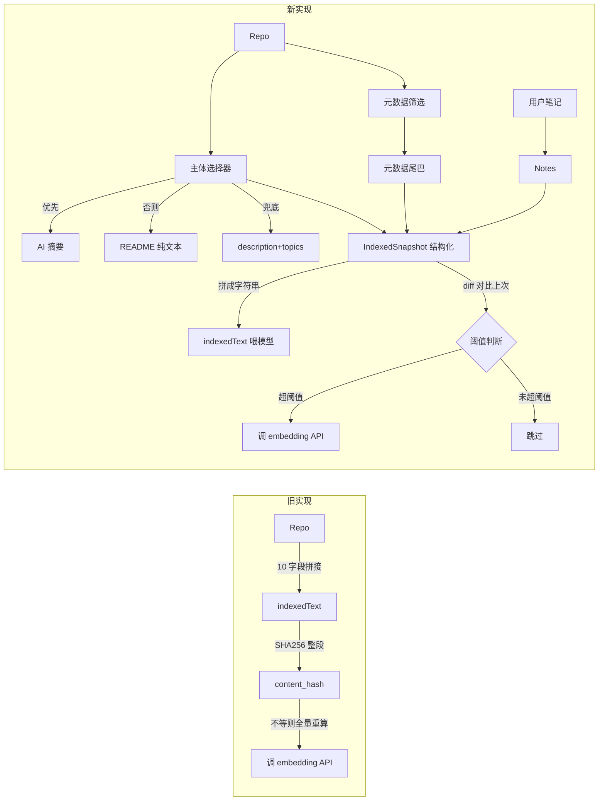
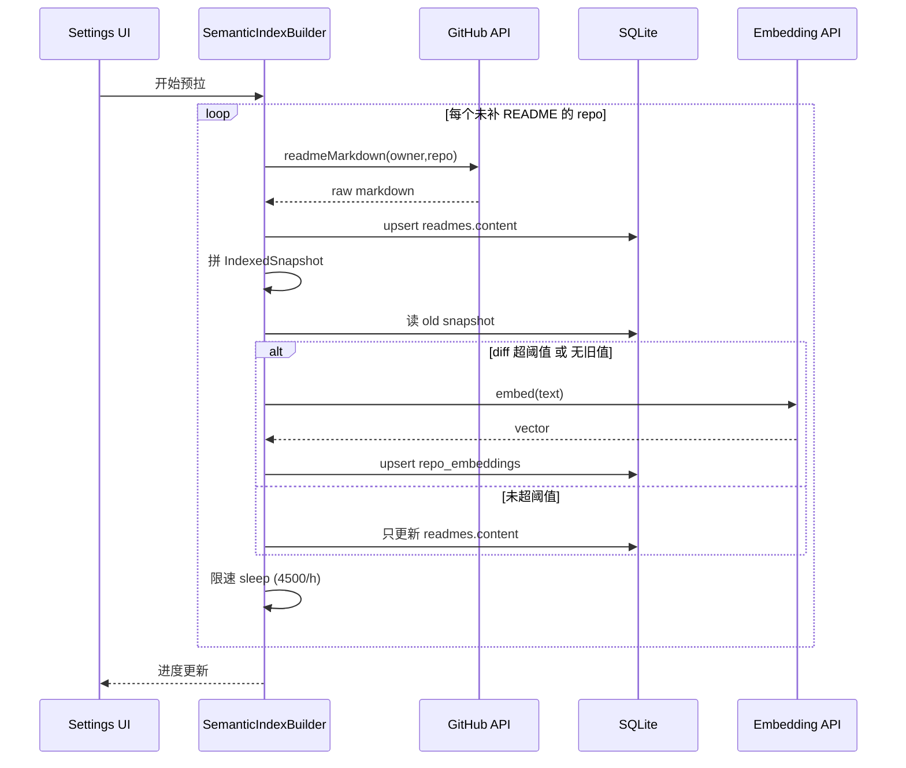

# 26 — 向量搜索改进

> 状态：实施中（2026-06-12 起）
>
> 背景输入：`docs/需求讨论/向量搜索改进-背景总结.md`
>
> 关联文档：`docs/详细设计/04-技术选型.md` §AI / `06-核心模块设计.md` §SemanticSearchService

---

## 1. 问题与目标

### 1.1 现状

`SemanticSearchService` 把 repo 元数据按 key-value 拼接成 `indexedText`，丢给 embedding 模型生成向量。喂模型的字段是 10 个：

```
Repository: {fullName}
Owner: {owner}
Name: {name}
Description: {description}
Language: {language}
Topics: {topics}
License: {license}
Homepage: {homepage}
Stars: {starsCount}
Forks: {forksCount}
```

**问题 1**：全是结构化标签，**不是自然语言**。embedding 模型在自然语言语料上训练，对 `Stars: 12345` 这种 key-value 提取不出"适合做后台任务的框架"这种语义信号。

**问题 2**：`content_hash = SHA256(indexedText)`，包含 stars / forks 等高频变化字段。每次 GitHub 增量同步后，stars 涨一个 hash 就变，整个 repo 走 embedding API 重建，但实际语义没变。

### 1.2 目标

把 `indexedText` 从「key-value 元数据拼接」改造成「自然语言主体 + 元数据尾巴 + 用户笔记」三段式，配合：

- **原始 Markdown 落库**：让 `readmes.content` 真正存原文（当前 schema 有列但所有写入路径都是 nil）
- **行级 diff 阈值替代 hash**：忽略 README 的小改动（Badge / 版本号 / typo），只在"主体真改了 10%+"时才重建
- **字段筛选**：移除 stars / forks / owner / name / 时间戳——数值类对向量语义无贡献且高频变化
- **后台慢速预拉 + 按需懒补全**：解决三级降级"覆盖率不够"问题

---

## 2. 设计决策清单

设计阶段与 dong4j 收敛的 8 条决策：

| ID | 决策 | 选项 |
|---|---|---|
| A | README 噪声清洗 | A3：先做简单清洗 + 字符截断，章节黑白名单留后续。**2026-06-13 修订**：dong4j 推翻「保留行内 HTML 标签让 embedding 模型自己看到结构」子决策，markdown 路径与 `process(html:)` 一刀切对齐 —— `readmes.content` 唯一消费者是机器（向量化 / AI 摘要），HTML 标签是纯噪声 token。落地：`ReadmeAPI.refreshMarkdownIfNeeded` 落库前调 `ReadmePreprocessor.sanitize(markdown:)` 一次性净化，`readmes.content` 列直接存清洗后的纯文本；下游消费方零开销 |
| B | `readmes.plain_text` 缓存列 | 不加。`readmes.content` 已存在 schema，直接复用 |
| C1 | 新 repo SWR 拉到 README 后 | 自动判一次 diff 阈值，符合才真重建向量 |
| C2 | 截断长度配置项 | 默认 12000、范围 2000-32000，步进 1000 |
| D | indexedText 字段筛选 | 保留 fullName / description / language / topics / license / homepage + 主体 + 笔记；**移除 stars / forks / owner / name / 时间戳** |
| E | 怎么拉原始 Markdown | E3：懒补全（HTML 仍是 WebView 主路径，AI 触发时按需补一次 raw Markdown 落 `readmes.content`） |
| F | diff 算法粒度 | F2：行级 diff，`changed_lines / total_lines > 阈值` |
| G | 阈值默认值 | 主体 10% / 笔记 20%；三档预设（严格 5% / 标准 10% / 宽松 20%）+ 折叠暴露具体数字 |

---

## 3. 核心数据流（变更前后）



### 3.1 最终 indexedText 结构

```
[主体段]
{AI 摘要 / README 纯文本 / description+topics 兜底}

[用户笔记]（如果有）
User Notes: ...

[元数据尾巴]
Repository: owner/name
Description: ...
Language: Swift
Topics: ios, swiftui
License: MIT
Homepage: https://...
```

字段筛选表：

| 字段 | 进 indexedText 与 snapshot | 备注 |
|---|---|---|
| AI 摘要 / README / 兜底主体 | 是 | 核心语义信号 |
| 用户笔记 | 是 | 用户主观信号 |
| fullName | 是 | 永久不变（rename 罕见），给模型识别信号 |
| description | 是 | 语义核心 |
| language | 是 | 精确标签，变化极低 |
| topics | 是 | 精确标签，用户改 = 定位变化 |
| license | 是 | 精确标签，变化极低 |
| homepage | 是 | 弱信号但稳定 |
| owner / name | **否** | fullName 已覆盖，去冗余 |
| **stars / forks / watchers** | **否** | 数值类，无语义贡献，高频变化 |
| created_at / updated_at / pushed_at | **否** | 时间戳，无语义 |

---

## 4. 数据模型变更

### 4.1 `repo_embeddings` 表

**项目当前是产品上线前**，按 [`DatabaseMigrationsV1.swift`](../Starcat/Core/Database/Migrations/DatabaseMigrationsV1.swift) 顶部约定**直接改 v1 建表**，不写 ALTER TABLE 迁移。

变更前：

```swift
t.column("content_hash", .text).notNull()
t.column("dimensions", .integer).notNull()
t.column("embedding", .blob).notNull()
t.column("indexed_text", .text).notNull()
```

变更后：

```swift
t.column("snapshot_json", .text).notNull()  // 结构化快照 JSON
t.column("dimensions", .integer).notNull()
t.column("embedding", .blob).notNull()
// 删除 content_hash 与 indexed_text 两列
```

**为什么不留 `content_hash` 做"兼容回滚"**：v1 直接重建 + 项目未上线 = 没有兼容性负担。`snapshot_json` 反序列化即可拿到 indexedText 的全部信息（body / notes / metadata），renderer 实时拼即可，不需要单独存 indexedText 列。

`idx_repo_embeddings_model_hash` 索引也随 content_hash 一起去掉（不再有 hash 命中查询路径）。

### 4.2 `readmes.content` 字段

Schema 不变，但**写入路径补全**：[`ReadmeAPI`](../Starcat/Core/Network/GitHubAPI/ReadmeAPI.swift) 当前所有 `Readme.content` 都写 nil，本次改造让它真正落原始 Markdown（按需懒补全）。

---

## 5. 模块改动清单

### 5.1 新增组件

| 文件 | 职责 |
|---|---|
| [`Features/AI/ReadmePreprocessor.swift`](../Starcat/Features/AI/ReadmePreprocessor.swift) | README 清洗 + 截断（HTML / Markdown 两入口）。**2026-06-13 修订**：抽出 `sanitize(markdown:)` 独立公开方法（不截断），供 `ReadmeAPI.refreshMarkdownIfNeeded` 落库前一次性调用；`process(markdown:)` 改为 `truncate(sanitize(...))` 薄封装。sanitize 内部**先 decode entity 再 strip 标签**保幂等性 |
| [`Features/AI/IndexedSnapshot.swift`](../Starcat/Features/AI/IndexedSnapshot.swift) | 结构化快照：body / notes / metadata，Codable |
| [`Features/AI/IndexedTextBuilder.swift`](../Starcat/Features/AI/IndexedTextBuilder.swift) | 三级降级主体 + 元数据尾巴 + 笔记拼接；`render` 把 snapshot 拼成喂模型字符串 |
| [`Features/AI/IndexedTextDiff.swift`](../Starcat/Features/AI/IndexedTextDiff.swift) | F2 行级 diff + 三档阈值判断 `shouldRebuild` |
| [`Features/AI/SemanticIndexBuilder.swift`](../Starcat/Features/AI/SemanticIndexBuilder.swift) | 后台慢速预拉服务：双队列限速 README + Embedding |

### 5.2 修改的核心文件

| 文件 | 改动 |
|---|---|
| [`Core/Database/Migrations/DatabaseMigrationsV1.swift`](../Starcat/Core/Database/Migrations/DatabaseMigrationsV1.swift) | `createRepoEmbeddings` 改 schema |
| [`Core/Database/Models/RepoEmbedding.swift`](../Starcat/Core/Database/Models/RepoEmbedding.swift) | 字段调整：去 `contentHash` / `indexedText`，加 `snapshotJson` |
| [`Core/Sync/RepoEmbeddingRepository.swift`](../Starcat/Core/Sync/RepoEmbeddingRepository.swift) | 适配新模型 |
| [`Core/Network/GitHubAPI/GitHubAPIClientProtocol.swift`](../Starcat/Core/Network/GitHubAPI/GitHubAPIClientProtocol.swift) | 加 `readmeMarkdown` 端点 |
| [`Core/Network/GitHubAPI/ReadmeAPI.swift`](../Starcat/Core/Network/GitHubAPI/ReadmeAPI.swift) | 加 `refreshMarkdownIfNeeded` 懒补全 |
| [`Features/AI/SemanticSearchService.swift`](../Starcat/Features/AI/SemanticSearchService.swift) | 删 makeIndexedText/hash，接入 Builder + Diff |
| [`Features/AI/RepoAIInsightService.swift`](../Starcat/Features/AI/RepoAIInsightService.swift) | makeSource 改用 Preprocessor；摘要生成后触发 refreshIndexIfChanged |
| [`Features/Notes/RepoNotesSection.swift`](../Starcat/Features/Notes/RepoNotesSection.swift) | 笔记 upsert 后触发 refreshIndexIfChanged（已有 800ms debounce） |
| [`Core/Settings/AppSettings.swift`](../Starcat/Core/Settings/AppSettings.swift) | 新增 5 个字段 |
| [`Features/Settings/AISettingsView.swift`](../Starcat/Features/Settings/AISettingsView.swift) | 加 "AI 索引" Section |
| [`Resources/Localizable.xcstrings`](../Starcat/Resources/Localizable.xcstrings) | 新增本地化键 |

---

## 6. 关键流程

### 6.1 单 repo 索引判定（refreshIndexIfChanged）

```swift
func refreshIndexIfChanged(for repo: Repo) async throws {
    let readme = try await readmeRepository.find(repoId: repo.id)
    let summary = try await summaryRepository.find(repoId: repo.id, model: cacheModelKey)
    let note = try await noteRepository.find(repoId: repo.id)

    let new = IndexedTextBuilder.buildSnapshot(
        repo: repo, readme: readme, summary: summary, note: note,
        truncateLength: settings.aiReadmeTruncateLength
    )
    let existing = try await embeddingRepository.fetchEmbeddingByRepoID(
        model: model, repoIDs: [repo.id]
    )[repo.id]
    let old = existing.flatMap { IndexedSnapshot.decode(from: $0.snapshotJson) }

    guard IndexedTextDiff.shouldRebuild(
        old: old, new: new,
        thresholds: settings.diffThresholds
    ) else { return }

    let text = IndexedTextBuilder.render(snapshot: new)
    let vector = try await client.embedding(input: text, model: model)
    try await embeddingRepository.upsert([
        RepoEmbedding(repoId: repo.id, model: model,
                      snapshotJson: new.encode(), vector: vector, updatedAt: now)
    ])
}
```

### 6.2 后台预拉服务（SemanticIndexBuilder）



**双队列限速**：

- README 拉取队列：4500/h（留 GitHub API 配额 buffer，每用户 5000/h）
- Embedding 调用队列：限速由 `aiEmbeddingTask` provider 决定（本地 Ollama 不限，OpenAI tier 1 是 3000 RPM）

### 6.3 触发链路

| 触发源 | 行为 | 实现位置 | 状态 |
|---|---|---|---|
| 用户在 Settings 点"开始预拉" | `SemanticIndexBuilder.start()` 后台慢速拉全部缺 README 的 repo | `AISettingsView.swift` `builderControlsRow` | ✅ 2026-06-12 落地 |
| AI 摘要生成成功 | `refreshIndexIfChanged(for: repo)` 单 repo 路径 | `AppDependencies.swift` `setOnSummaryGenerated` 闭包 | ✅ 2026-06-12 落地 |
| 用户笔记 upsert 成功（已带 800ms debounce） | `refreshIndexIfChanged(for: repo)`（笔记后再叠 1500ms 二级 debounce） | `RepoNotesSection.swift` `refreshIndexTask` | ✅ 2026-06-12 落地 |
| **`aiIndexAutoPrefetchEnabled` 开启 + 登录态稳定** | 启动期 / 登录恢复 / 用户运行期勾选 Toggle → `SemanticIndexBuilder.start()` | `HomeView.swift` `.task` + `.onChange(of: authSession.state)` + `.onChange(of: settings.aiIndexAutoPrefetchEnabled)` | ✅ **2026-06-13 dong4j 补救 A 补齐** |
| 详情页 README 拉到（SWR 三阶段：cache 命中 / `.updated` / `.notModified`） | 异步补 raw Markdown 落 `readmes.content` + `.updated` 时再 `refreshIndexIfChanged` | `ReadmeViewModel.swift` `onHTMLLoaded` 回调（manage 路径 only）+ `HomeView.swift` 装配处闭包 | ✅ **2026-06-13 dong4j 补救 B 补齐** |
| 搜索时（兜底，无 force） | `ensureIndexed` 内部仍走 diff 判定，缺失或超阈值才补建 | `SemanticSearchService.swift` `ensureIndexed` | ✅ 2026-06-12 落地 |

> ⚠️ **2026-06-13 修订背景**：表格中标 ⚠️ 的两条触发源在 2026-06-12 v1 落地时被遗漏 ——
> `aiIndexAutoPrefetchEnabled` Toggle 只挂了 UI binding + UserDefaults 持久化，但**没有任何代码消费这个 setting** 来真的驱动 Builder；
> "详情页 README 拉到 → 补 markdown" 在 `ReadmeViewModel` 内**完全没接 `refreshMarkdownIfNeeded`**。
> dong4j 在 2026-06-13 反馈「设置页开了 Toggle 等很久没拿到 markdown」时定位到这两个洞，本次一次性补齐并加入文档约束。

---

## 7. 配置项（AppSettings）

| 字段 | 类型 | 默认 | 范围 | 说明 |
|---|---|---|---|---|
| `aiReadmeTruncateLength` | Int | 12000 | 2000-32000 | README 纯文本截断长度（字符数） |
| `aiIndexPreset` | enum | `.standard` | strict/standard/relaxed | diff 阈值预设 |
| `aiIndexBodyDiffRatio` | Double | 0.10 | 0.0-0.5 | 主体行变化阈值（预设 strict=0.05 / standard=0.10 / relaxed=0.20） |
| `aiIndexNotesDiffRatio` | Double | 0.20 | 0.0-0.5 | 笔记行变化阈值 |
| `aiIndexAutoPrefetchEnabled` | Bool | false | - | 自动开始预拉（默认关，避免无声烧 API） |

预设切换时把 body/notes 数字推送到具体字段；用户在折叠区微调具体数字时自动切到"自定义"（不再属于任何预设）。

---

## 8. 测试计划

| Suite | 覆盖 |
|---|---|
| `ReadmePreprocessorTests` | **2026-06-13 新增（21 case / 2 Suite）**：① `sanitize(markdown:)` 行为契约 —— 纯文本 / 空串 / 行内标签 strip / 块级标签 strip / `<script>`/`<style>` 整段含内容 / `` + `` / 5 种非角括号 entity 解码 / `<...>` 配对解码后被 strip / 单独 `<` 保留 / `≥3` 空行压缩 / 单空行保留 / 行内 trim / 整体 trim / **幂等性**（关键契约）/ markdown 链接 `[text](url)` 保留 / 综合 README 节选；② `process(markdown:)` 契约 —— `process == truncate(sanitize(...))` / 按 `maxLength` 截断 / 对已 sanitize 字符串幂等。HTML 路径边界（`process(html:)`）由现有测试覆盖 |
| `IndexedTextBuilderTests` | 三级降级（有摘要 / 只有 README / 兜底）+ 元数据尾巴拼接 |
| `IndexedTextDiffTests` | 行级 diff 比例 + 三档阈值边界 + metadata 任一变化触发 |
| `IndexedSnapshotTests` | Codable 编解码 + 字段缺失向后兼容 |
| `SemanticSearchTests`（更新） | mock embeddingRepository + mock client，验证 diff 超/未超时不同行为 |

---

## 9. 风险与缓解

| 风险 | 缓解 |
|---|---|
| 首次切换全量重建代价大 | 默认 `aiIndexAutoPrefetchEnabled = false`，用户主动启动；旧向量保留可读不中断 |
| GitHub API 配额吃紧 | 双队列限速 4500/h |
| diff 阈值校准困难 | 三档预设 + 折叠区显式数字 + 设置页直接调整 |
| 笔记触发风暴 | 复用现有 `RepoNotesSection` 的 800ms debounce，不在 onChange 触发而在 saveContent 完成后触发 |

---

## 10. 后续可演进方向（不在本次范围）

- 章节黑白名单清洗（A2）：基于 H1/H2 跳过 License / Star History / Contributors / TOC 等噪声段
- 全切 Markdown 客户端渲染（E1）：彻底替代 HTML，省一次 API 请求
- 混合检索：向量召回 + SQL 精确过滤（`WHERE language='Swift'` 等），保留语义又不丢精确标签信号
- 重建预览面板：让用户在大批量重建前看到哪些 repo 会被触发

---

*最后更新：2026-06-12*
