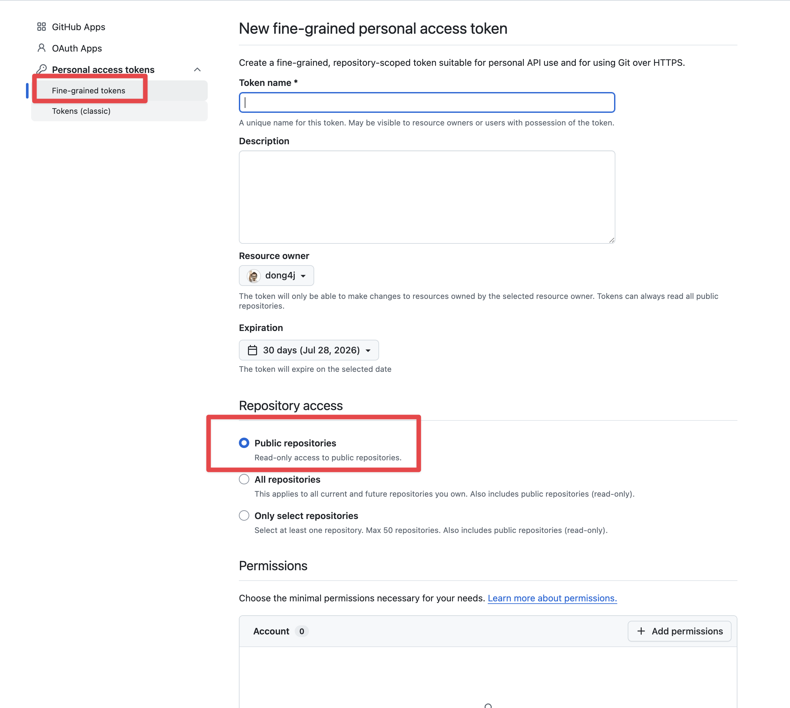

# GitHub Token 提供指南

> 适用对象：愿意给 Starcat 后端提供 GitHub API 读取额度的朋友。
> 用途：Starcat 后端读取公开 GitHub 仓库元数据与 README，用于补全 Trending / Weekly / Discovery 数据。

## 先说明

Starcat 只需要读取公开仓库信息，不需要写仓库、不需要读私有仓库、不需要管理组织、不需要访问 Actions / Packages / Secrets。

请优先提供 **Fine-grained personal access token**，不要提供 classic token。Fine-grained token 可以限制在公开仓库与只读权限，风险更小，也方便随时撤销。

创建入口：

- [创建 Fine-grained personal access token](https://github.com/settings/personal-access-tokens/new)
- [GitHub 官方：管理 personal access tokens](https://docs.github.com/en/authentication/keeping-your-account-and-data-secure/managing-your-personal-access-tokens)

## 推荐配置

进入创建页面后，按下面配置：

| 配置项 | 推荐值 | 说明 |
| --- | --- | --- |
| Token name | `Starcat public repo metadata` | 名字只用于你自己识别 |
| Expiration | 30 天或 90 天 | 不建议设置永不过期 |
| Resource owner | 你的个人账号 | 不需要选择组织 |
| Repository access | Public repositories only | 只允许访问公开仓库 |
| Repository permissions | `Contents: Read-only` | 用于读取公开仓库 README / contents |
| Account permissions | 全部不授予 | Starcat 不需要账号级权限 |

GitHub 的 `Metadata` 权限通常会随 fine-grained token 自动具备只读访问，不需要额外打开写权限。

